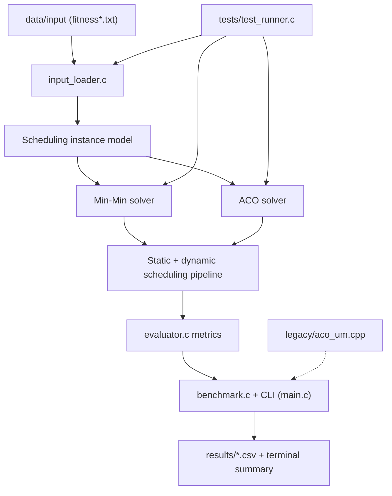
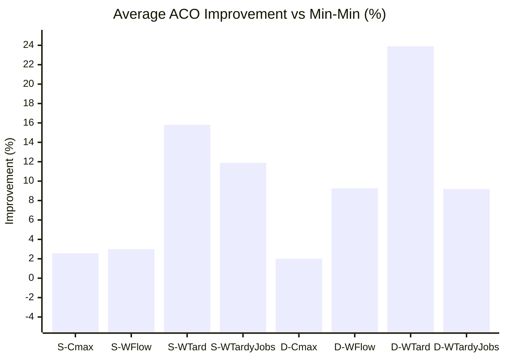
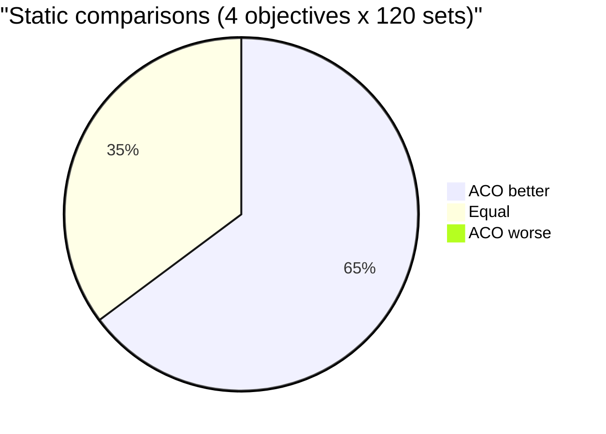
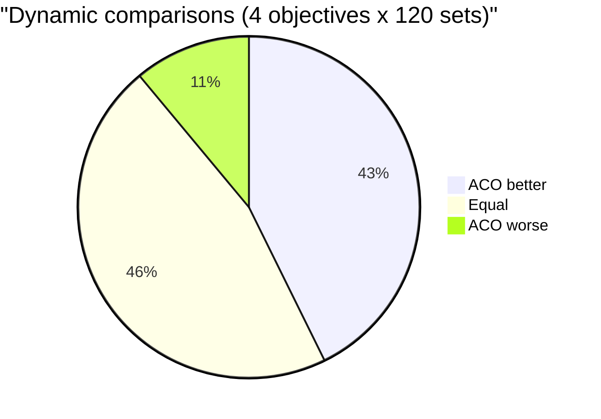

# Unrelated Machines Scheduling in C

This repository contains a modern C rewrite of my bachelor thesis completed at the Faculty of Electrical Engineering and Computing (FER), University of Zagreb.

The thesis was developed under the mentorship of **doc. dr. sc. Domagoj Jakobović** at the **Department of Electronics, Microelectronics, Computer and Intelligent Systems**.

Defense date: **6 July 2011**

Committee:

1. doc. dr. sc. Domagoj Jakobović
2. Ivan Budiselić, dipl. ing.
3. Ivan Žužak, dipl. ing.

Clean, modular C implementation of **job scheduling on parallel unrelated machines** for both:

- **static environment** (all jobs known before scheduling), and
- **dynamic environment** (jobs released over time, online re-optimization).

The project compares two algorithms:

- **Min-Min** (deterministic baseline),
- **Ant Colony Optimization (ACO)** (metaheuristic solver with objective-aware local search).

This is a full rewrite of the legacy thesis-era codebase, with clear architecture, English nomenclature, test coverage, reproducible benchmarks, and separated data folders.

## Project Diagram



## Features

- Modular C11 codebase split across focused source/header files.
- Supports core objectives:
  - `makespan` (`Cmax`)
  - `weighted_flow`
  - `weighted_tardiness`
  - `weighted_tardy_jobs`
- Static and dynamic scheduling modes.
- ACO supports heuristics:
  - `edd`
  - `spt`
  - `wspt`
  - `mon`
- Input dataset loader compatible with thesis `fitness*.txt` format.
- CSV export for experiment results.
- Unit/integration test runner.
- Professional CLI output with run configuration, per-set stats (`--verbose`), and total execution time.

## Project Structure

```text
.
├── include/
│   ├── scheduling_types.h
│   ├── instance.h
│   ├── input_loader.h
│   ├── evaluator.h
│   ├── minmin.h
│   ├── aco.h
│   ├── dynamic_scheduler.h
│   ├── benchmark.h
│   └── rng.h
├── src/
│   ├── instance.c
│   ├── input_loader.c
│   ├── evaluator.c
│   ├── minmin.c
│   ├── aco.c
│   ├── dynamic_scheduler.c
│   ├── benchmark.c
│   ├── rng.c
│   └── main.c
├── tests/
│   └── test_runner.c
├── data/
│   ├── input/
│   │   ├── fitness.txt
│   │   ├── fitness_ready.txt
│   │   ├── fitness_duration.txt
│   │   ├── fitness_deadline.txt
│   │   └── fitness_weight.txt
│   └── samples/
├── legacy/
│   └── aco_um.cpp
├── results/
├── Makefile
└── README.md
```

## Build

Requirements:

- C compiler with C11 support (`clang` or `gcc`)
- `make`

Build:

```bash
make all
```

Run tests:

```bash
make test
```

`make test` includes integration checks that load and schedule jobs from `data/input/fitness*.txt`.

## CLI Usage

Main executable:

```bash
./bin/scheduler [options]
```

Common options:

- `--input-root PATH` (default: `data/input`)
- `--set-start N`
- `--set-end N`
- `--mode static|dynamic`
- `--objective makespan|weighted_flow|weighted_tardiness|weighted_tardy_jobs`
- `--heuristic edd|spt|wspt|mon`
- `--ants N`
- `--iterations N`
- `--alpha X`
- `--beta X`
- `--rho X`
- `--tau0 X`
- `--q0 X`
- `--seed N`
- `--csv PATH`
- `--verbose`

Help:

```bash
./bin/scheduler --help
```

## Algorithms

### Min-Min baseline

At each step:

1. For each unscheduled job, find the machine that yields minimum completion time.
2. Select the job-machine pair with the globally minimum completion time.
3. Commit assignment and update machine availability.

### ACO solver

Implemented as a job-machine construction graph with pheromone learning and objective-aware scoring.

Key elements:

- pheromone matrix on job-machine pairs,
- heuristic term (EDD/SPT/WSPT/MON),
- objective-aware desirability,
- elitist global pheromone reinforcement,
- Min-Min seeded initialization,
- local search refinement (machine reassignment + adjacent swap improvement).

## Dynamic Scheduling Strategy

Dynamic mode simulates online scheduling:

- jobs become available by `release_time`,
- solver re-optimizes over currently available jobs,
- one dispatch decision is committed per decision cycle,
- machine clocks and job availability are advanced event-by-event.

This provides a practical approximation of online scheduling in a static uncertainty-free simulator.

## Reproducible Benchmarks (Executed)

The following experiments were executed on input sets `0..119` (all available sets).

Static mode parameters:

- `ants=12`, `iterations=30`, `seed=123`

Dynamic mode parameters:

- `ants=8`, `iterations=15`, `seed=123`

### Summary (Average Objective Value)

| Mode | Objective | Min-Min | ACO | Improvement |
|---|---|---:|---:|---:|
| static | makespan | 319.2250 | 311.0500 | 2.56% |
| static | weighted_flow | 885.9822 | 859.4106 | 3.00% |
| static | weighted_tardiness | 136.6290 | 115.0380 | 15.80% |
| static | weighted_tardy_jobs | 2.4582 | 2.1662 | 11.88% |
| dynamic | makespan | 329.8000 | 323.2000 | 2.00% |
| dynamic | weighted_flow | 1067.9358 | 969.0757 | 9.26% |
| dynamic | weighted_tardiness | 123.5031 | 93.9852 | 23.90% |
| dynamic | weighted_tardy_jobs | 3.1938 | 2.9002 | 9.19% |

### Key Conclusions

- ACO outperforms Min-Min on average in all evaluated scenarios (8/8).
- In static mode, ACO is never worse on any set for any objective.
- In dynamic mode, ACO is still better on average, but it can be worse on a subset of sets.
- Largest average gains are on tardiness-driven objectives (`weighted_tardiness`, `weighted_tardy_jobs`).

### Head-to-Head Outcomes by Scenario (120 sets each)

| Mode | Objective | ACO Better | Equal | ACO Worse |
|---|---|---:|---:|---:|
| static | makespan | 78 | 42 | 0 |
| static | weighted_flow | 109 | 11 | 0 |
| static | weighted_tardiness | 75 | 45 | 0 |
| static | weighted_tardy_jobs | 49 | 71 | 0 |
| dynamic | makespan | 53 | 43 | 24 |
| dynamic | weighted_flow | 66 | 36 | 18 |
| dynamic | weighted_tardiness | 47 | 67 | 6 |
| dynamic | weighted_tardy_jobs | 39 | 76 | 5 |

### Improvement Range Across Sets

`improvement_percent = (Min-Min - ACO) / Min-Min * 100`

| Mode | Objective | Worst Set (index, %) | Best Set (index, %) |
|---|---|---:|---:|
| static | makespan | 1, 0.00% | 62, 33.33% |
| static | weighted_flow | 1, 0.00% | 24, 22.91% |
| static | weighted_tardiness | 0, 0.00% | 2, 100.00% |
| static | weighted_tardy_jobs | 0, 0.00% | 2, 100.00% |
| dynamic | makespan | 22, -12.96% | 47, 29.12% |
| dynamic | weighted_flow | 89, -19.86% | 118, 33.35% |
| dynamic | weighted_tardiness | 111, -166.67% | 8, 100.00% |
| dynamic | weighted_tardy_jobs | 111, -400.00% | 9, 100.00% |

### Visual Comparison







Generated CSV files:

- `results/static_makespan_0_119.csv`
- `results/static_weighted_flow_0_119.csv`
- `results/static_weighted_tardiness_0_119.csv`
- `results/static_weighted_tardy_jobs_0_119.csv`
- `results/dynamic_makespan_0_119.csv`
- `results/dynamic_weighted_flow_0_119.csv`
- `results/dynamic_weighted_tardiness_0_119.csv`
- `results/dynamic_weighted_tardy_jobs_0_119.csv`

## Example Commands

Static makespan benchmark:

```bash
./bin/scheduler \
  --input-root data/input \
  --set-start 0 --set-end 119 \
  --mode static \
  --objective makespan \
  --ants 12 --iterations 30 --seed 123 \
  --csv results/static_makespan_0_119.csv
```

Dynamic weighted tardiness benchmark:

```bash
./bin/scheduler \
  --input-root data/input \
  --set-start 0 --set-end 119 \
  --mode dynamic \
  --objective weighted_tardiness \
  --ants 8 --iterations 15 --seed 123 \
  --csv results/dynamic_weighted_tardiness_0_119.csv
```

## Notes

- Legacy thesis source file was moved to `legacy/aco_um.cpp` for historical reference.
- New implementation is fully in C and intended as the production-quality code path.
